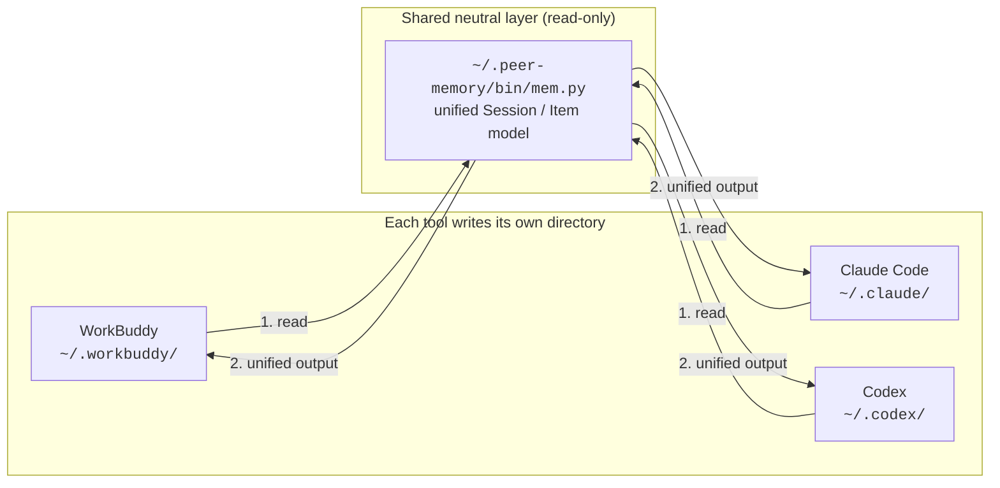

# peer-memory

**Let your AI coding tools see each other's memory.**

If you run WorkBuddy, Claude Code and Codex on the same machine, each one writes its own
conversation history and long-term memory to its own directory — and none of them can read
the others. You end up re-explaining the same context three times.

peer-memory is a **read-only neutral layer**: one retrieval engine plus a few thin skill
files, so any tool can look up what the others were told. Pure Python standard library,
zero dependencies, no network access.

```
v1.0.0 · Python 3.8+ · macOS / Linux / Windows · MIT
```

**Other languages**: [中文](README.md)

---

## What it solves

| | Before | After |
|---|---|---|
| Continuing a task in another tool | Copy-paste the whole context | Just ask "how did I handle this in the other tool?" |
| Finding a conclusion from months ago | Dig through jsonl, guess paths and schemas | `mem search "keyword"` |
| Preferences and conventions | Recorded separately, never synced | `mem memories --dump` shows all of them |
| Conflicting conclusions | You only remember the latest | Both versions shown side by side, you decide |

## How it works



All the differences between tools — directory layout, line format, whether the transcript
lives in jsonl or sqlite, and how each one pollutes user messages with injected system
prompts — are absorbed by three adapters inside `mem.py`. Only two concepts are exposed:
`Session` and `Item`.

**Nothing is ever written.** The engine never writes, modifies or deletes a file under any
tool's directory. SQLite databases are opened with `mode=ro`, so running tools are not
disturbed.

---

## Install

### One-liner (recommended)

```bash
git clone https://github.com/ximinsideyuezhang/peer-memory.git
cd peer-memory
sh install.sh          # macOS / Linux / Git Bash / WSL
```

```powershell
# Windows PowerShell
git clone https://github.com/ximinsideyuezhang/peer-memory.git
cd peer-memory
powershell -ExecutionPolicy Bypass -File .\install.ps1
```

The installer will:

1. copy the engine to `~/.peer-memory/`;
2. **auto-detect** which tools you have (`~/.workbuddy`, `~/.claude`, `~/.codex`) and
   install a skill only into those;
3. append a clearly marked, removable block to `~/.codex/AGENTS.md`
   (skip with `--no-agents-md`; `--uninstall` removes it precisely).

```bash
sh install.sh --dry-run          # preview only
sh install.sh --no-agents-md     # leave Codex AGENTS.md alone
sh install.sh --uninstall        # remove everything
```

### Manual install

```bash
cp -r bin docs README.md ~/.peer-memory/
cp -r skills/workbuddy ~/.workbuddy/skills/peer-memory
cp -r skills/claude    ~/.claude/skills/peer-memory
cp -r skills/codex     ~/.codex/skills/peer-memory
cat docs/agents-md-block.md >> ~/.codex/AGENTS.md     # optional, Codex only
```

### When it takes effect

| Tool | Activation |
|---|---|
| WorkBuddy | Open a new session |
| Claude Code | Open a new session |
| Codex | Next turn (skills are discovered from disk, no registration step) |

---

## Quick start

```bash
M="sh ~/.peer-memory/bin/mem.sh"
$M tools                                  # self-check: are the data sources readable?
```

```
peer-memory 1.0.0 environment check
shared dir: /home/you/.peer-memory

  [workbuddy] WorkBuddy     readable  sessions  42  memory files 5
              /home/you/.workbuddy
  [claude  ] Claude Code    readable  sessions  13  memory files 1
              /home/you/.claude
  [codex   ] Codex          readable  sessions  10  memory files 2
              /home/you/.codex
```

Then query away:

```bash
$M timeline --limit 20 --exclude workbuddy               # no keyword? start with the overview
$M search "bloom filter" --exclude workbuddy              # title + user input (fast)
$M search "bloom filter" --exclude workbuddy --scope full  # include assistant replies (thorough)
$M show claude 3d009c22                                   # expand one session
$M memories --dump                                        # long-term memory files
```

Inside WorkBuddy, just say *"check how I handled XX in Codex before"* — the skill adds
`--exclude workbuddy` automatically and always cites the source tool and date.

Full command reference: [docs/cheatsheet.md](docs/cheatsheet.md).

---

## Design notes

**Unified model instead of per-tool parsing.** Adding a new tool means implementing four
methods: `sessions()` / `items()` / `hydrate()` / `memory_files()`.

**Injection scrubbing.** Every tool injects system prompts and context into user messages.
Without cleaning, session titles degrade into junk like `<environment_context>`.

**Tiered search.** `--scope titles` scans titles and user input only and returns in
milliseconds; `--scope full` digs into assistant replies when you need it.

**Fault tolerant.** A malformed line is skipped, not fatal. One broken data source does not
affect the others.

**Cross-platform.** The three launchers (`.sh` / `.cmd` / `.ps1`) behave identically and
**actually execute** `--version` to pick an interpreter rather than trusting PATH —
see the FAQ below for why that matters.

---

## Privacy

- **Fully local.** No network calls, no third-party services, no telemetry.
- **Read-only.** Nothing is written to, modified in, or deleted from any tool's directory.
- **Be aware**: the AI tool that runs the query reads the results into its own context.
  Cross-tool lookup inherently widens what each tool can see.

---

## FAQ

**Why not an MCP server?**
MCP requires every tool to configure and trust a server, and the private storage formats
still have to be parsed anyway. A local script is zero-config and works across all three.
An MCP wrapper would be a thin shim over the same engine.

**Why do the launchers execute the interpreter instead of just checking PATH?**
Windows ships a **0-byte `python.exe` stub** (an App Execution Alias) at
`%LOCALAPPDATA%\Microsoft\WindowsApps\`. It is on PATH, so `where python` and
`Get-Command python` both find it — but running it fails with exit code **9009**.
Any "found it, use it" logic hits that stub first. So every launcher runs each candidate
with `--version`, accepts only exit code 0, rejects 0-byte files, and skips anything whose
path contains `WindowsApps`.

**Why PowerShell for Codex?**
Codex executes commands through PowerShell on Windows. Also, PowerShell 5.1 decodes child
process output using the system ANSI code page, garbling UTF-8 output — `mem.ps1` sets
`[Console]::OutputEncoding` explicitly. If ExecutionPolicy blocks `.ps1`, use `mem.cmd`
(execution policy applies to `.ps1` only, not `.cmd`).

**Which tools are supported?**
WorkBuddy, Claude Code and Codex are built in. Others need an adapter —
see [docs/memory-map.md](docs/memory-map.md).

---

## Known limitations

- The internal storage formats are **not public contracts** and may drift between versions.
  Parsing is defensive, but updates may be needed — issues with redacted sample lines welcome.
- `--scope full` on a large history is noticeably slower; narrow it with `--since` /
  `--max-sessions`.
- Only transcripts and memory files are read; tool calls, chain-of-thought and attachments
  are not parsed.

## Development

```bash
python3 tests/test_smoke.py      # zero-dependency smoke tests, never touches your real data
```

The tests build three fake data sources in a temp directory and point the engine at them via
`PEER_*_HOME` environment variables, so they run anywhere, including CI. Coverage includes
adapter detection, title extraction and fallback, injection scrubbing, Codex `developer`
role filtering, both search scopes, `--exclude`, `--json`, and a regression test that the
launcher **rejects an interpreter that exists but fails to run**.

CI runs the suite on Linux / macOS / Windows × Python 3.8–3.12.

## License

[MIT](LICENSE)
