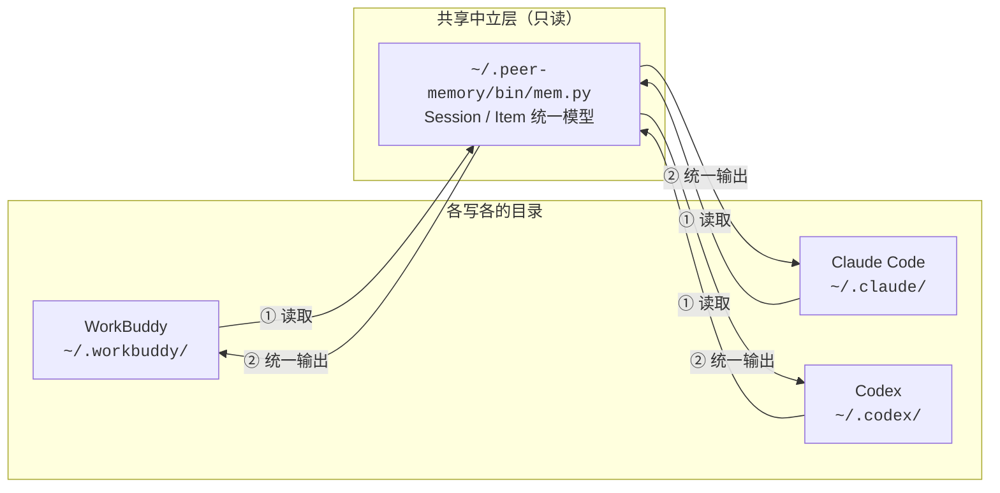

# peer-memory

**让你的 AI 工具互相看见对方的记忆。**

同一台机器上装了 WorkBuddy、Claude Code、Codex，它们的对话历史和长期记忆各写各的目录，
互相读不到——同一件事要在三个工具里重复交代一遍。

peer-memory 是一个**只读的中立层**：一份检索脚本 + 几份薄壳技能，
让任一工具都能查到另外几家的历史。纯 Python 标准库，零依赖，不联网。

```
v1.0.0 · Python 3.8+ · macOS / Linux / Windows · MIT
```

**其他语言**：[English](README.en.md)

---

## 它解决什么

| | 之前 | 之后 |
|---|---|---|
| 换工具继续同一个问题 | 得把上下文复制粘贴过去 | 直接问"我之前在别的工具里怎么处理的" |
| 找一句半年前聊过的结论 | 手动翻 jsonl、猜路径、猜格式 | `mem search "关键词"` |
| 偏好和约定 | 每个工具各记一份，互不同步 | `mem memories --dump` 一次看全 |
| 有冲突的结论 | 只记得最近那次 | 两家原文并列，你自己裁决 |

## 工作原理



三家的存储差异（目录布局、行格式、正文在 jsonl 还是 sqlite、系统注入的清洗规则）
全部收敛在 `mem.py` 的三个 Adapter 里，对外只暴露 `Session` 和 `Item` 两个概念。

**任何一方都只读。** 引擎不写、不改、不删任何工具目录下的文件，
sqlite 一律以 `mode=ro` 打开，不会干扰正在运行的进程。

---

## 安装

### 一键安装（推荐）

```bash
git clone https://github.com/ximinsideyuezhang/peer-memory.git
cd peer-memory
sh install.sh          # macOS / Linux / Git Bash / WSL
```

```powershell
# Windows PowerShell
git clone https://github.com/ximinsideyuezhang/peer-memory.git
cd peer-memory
powershell -ExecutionPolicy Bypass -File .\install.ps1
```

安装脚本会：

1. 把引擎复制到 `~/.peer-memory/`；
2. **自动探测**你装了哪些工具（`~/.workbuddy`、`~/.claude`、`~/.codex`），
   只给存在的工具装技能；
3. 在 `~/.codex/AGENTS.md` 里追加一个带标记的说明块
   （`--no-agents-md` 可跳过；卸载时会精确移除）。

常用开关：

```bash
sh install.sh --dry-run          # 只预览，不落盘
sh install.sh --no-agents-md     # 不碰 Codex 的 AGENTS.md
sh install.sh --force            # 目标目录非空时强制执行
sh install.sh --uninstall        # 完整卸载
```

### 手动安装

不想跑脚本的话，三步：

```bash
# 1. 引擎放到中立位置
cp -r bin docs README.md ~/.peer-memory/

# 2. 技能放到各工具的技能目录（只放你装了的那几个）
cp -r skills/workbuddy ~/.workbuddy/skills/peer-memory
cp -r skills/claude    ~/.claude/skills/peer-memory
cp -r skills/codex     ~/.codex/skills/peer-memory

# 3. 可选：给 Codex 加全局说明块
cat docs/agents-md-block.md >> ~/.codex/AGENTS.md
```

### 生效时机

| 工具 | 生效方式 |
|---|---|
| WorkBuddy | 新开一个会话 |
| Claude Code | 新开一个会话 |
| Codex | 下一轮对话（技能按目录实时发现，无需注册） |

---

## 快速开始

```bash
M="sh ~/.peer-memory/bin/mem.sh"

$M tools                                  # 先自检，确认数据源可读
```

```
peer-memory 1.0.0 环境自检
共享目录: /home/you/.peer-memory

  [workbuddy] WorkBuddy     可读  会话  42  记忆文件 5
              /home/you/.workbuddy
  [claude  ] Claude Code    可读  会话  13  记忆文件 1
              /home/you/.claude
  [codex   ] Codex          可读  会话  10  记忆文件 2
              /home/you/.codex
```

然后就可以查了：

```bash
$M timeline --limit 20 --exclude workbuddy          # 不知道关键词？先看全景
$M search "布隆过滤器" --exclude workbuddy           # 关键词检索（快）
$M search "布隆过滤器" --exclude workbuddy --scope full   # 连助手回复一起搜（全）
$M show claude 3d009c22                             # 展开某个会话
$M memories --dump                                  # 看长期记忆文件
```

在 WorkBuddy 里直接说 **"查一下我在 Codex 里之前是怎么处理 XX 的"**，
技能会自动带上 `--exclude workbuddy` 去查另外两家，并注明来源工具和日期。

完整命令与选项见 [速查卡](docs/cheatsheet.md)。

### 直接让 AI 自己用

装好技能后，在每个工具里都可以这样说：

- 「我之前在别的 AI 工具里聊过 XX 吗？」
- 「查一下另外两个工具的记忆里有没有关于 XX 的内容」
- 「那个方案之前讨论过吗，别的工具里有没有留下结论？」

---

## 特点

**统一模型，而不是逐个解析。** 三家格式差异全部封在 Adapter 里，
新增工具只需实现 `sessions()` / `items()` / `hydrate()` / `memory_files()` 四个方法。

**注入清洗。** 各家都会把系统提示、上下文、技能文档塞进用户消息。
引擎内置清洗规则剥掉这些噪音——否则会话标题会退化成 `<environment_context>` 这种垃圾值。

**分层检索。** `--scope titles` 只扫标题和用户输入，毫秒级；
要深挖时再上 `--scope full`，避免每次都全量解析几 MB 的 transcript。

**容错。** 单行解析失败直接跳过，单个数据源损坏不影响其他源，
sqlite 只读打开不干扰写入方。

**跨平台。** 三个启动器（`.sh` / `.cmd` / `.ps1`）行为一致，
都会**真跑一次 `--version`** 来挑解释器，而不是只查路径是否存在
（原因见下面 FAQ）。

---

## 隐私

- **全部在本地。** 脚本不联网、不依赖任何第三方服务，没有任何遥测。
- **只读。** 不写、不改、不删任何工具目录下的文件；卸载时也只删自己装的那部分。
- **输出给你自己看。** 检索结果只打印到终端。但请注意：
  AI 工具会把检索结果读进上下文——你查了什么，那个工具就会知道什么。
  跨工具查询天然会扩大信息的可见范围，心里有数即可。

---

## FAQ

**为什么不做成 MCP Server？**
MCP 需要每个工具各自配置并信任一个服务器，而各家的私有存储格式本来就得自己解析；
一个本地脚本零配置、三端通用，反而更省事。真要做 MCP 也是个薄封装，引擎不用动。

**为什么启动器要"真跑一次"解释器，而不是查 PATH？**
Windows 在 `%LOCALAPPDATA%\Microsoft\WindowsApps\` 下放了一个 **0 字节的 `python.exe` 存根**
（App Execution Alias）。它在 PATH 上，`where python` 和 `Get-Command python` 都能找到它，
但一执行就返回 **9009（命令未找到）**。任何"找到就用"的逻辑都会第一个撞上它。
所以三个启动器都改为：逐个候选**执行 `--version`**，退出码为 0 才采用，
并显式拒绝 0 字节文件、跳过路径含 `WindowsApps` 的候选。

**为什么 Codex 侧要用 PowerShell 而不是 bash？**
Codex 在 Windows 上通过 PowerShell 执行命令。另外 PowerShell 5.1 会用系统 ANSI 代码页
解码子进程输出，把 UTF-8 中文变成乱码，`mem.ps1` 里显式设了 `[Console]::OutputEncoding`。
如果 ExecutionPolicy 挡住 `.ps1`，换成 `mem.cmd`——执行策略只约束 `.ps1`。

**支持哪些工具？**
目前内置 WorkBuddy / Claude Code / Codex。其他工具需要写一个 Adapter，
见 [记忆地图](docs/memory-map.md#接入新工具)。

---

## 文档

| 文件 | 内容 |
|---|---|
| [docs/cheatsheet.md](docs/cheatsheet.md) | 命令、选项、环境变量、排查，一页看完 |
| [docs/memory-map.md](docs/memory-map.md) | 三家原生存储结构、行格式、路径编码规则、如何接入新工具 |

## 已知限制

- 各家的内部存储格式**不是公开契约**，随版本可能漂移。所有解析都做了容错，
  但某天可能需要跟着更新——欢迎提 Issue 并附上脱敏后的样本行。
- 大历史库下 `--scope full` 会明显变慢；用 `--since` / `--max-sessions` 收窄范围。
- `mem.py` 只读会话正文与记忆文件，不解析工具调用、思维链和附件。

## 开发

```bash
python3 tests/test_smoke.py      # 冒烟测试，零依赖，不碰你本机真实数据
```

测试在临时目录里自造三家样本数据，通过 `PEER_*_HOME` 环境变量把引擎指过去，
因此在任何机器和 CI 上都能跑。覆盖内容包括：

- 三家数据源识别、标题提取、无标题时的回退
- 系统注入清洗（`<system-reminder>`、技能注入、`tool_result`）
- Codex `role=developer` 注入的排除
- `titles` / `full` 两种检索深度、`--exclude` 过滤、`--json` 输出
- **启动器必须实测解释器**——用一个"存在但一跑就失败"的假解释器做回归测试

CI 在 Linux / macOS / Windows × Python 3.8–3.12 上跑同一套测试。

## License

[MIT](LICENSE)
